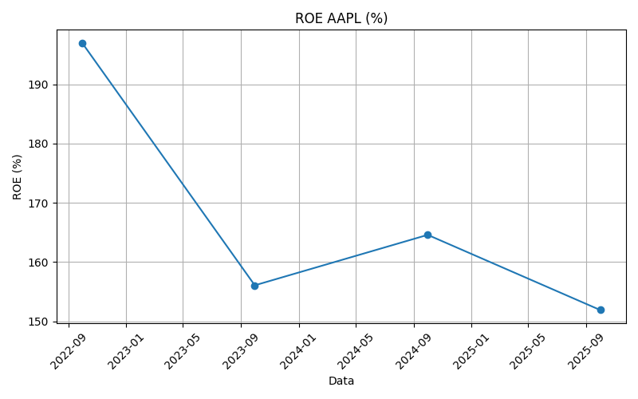

# Financial Ratio Analyzer

Skrypt w Pythonie do automatycznej analizy wskaźników finansowych 
spółek giełdowych na podstawie danych z Yahoo Finance.

## Co robi

Skrypt pobiera dane finansowe wybranej spółki (bilans i rachunek 
zysków i strat) i oblicza kluczowe wskaźniki:
- ROE (Return on Equity)
- ROA (Return on Assets)
- Marża netto
- Current Ratio
- Debt-to-Equity

Wyniki prezentowane są w tabeli oraz jako wykres trendu ROE 
z ostatnich 4 lat.

## Jak uruchomić

```bash
pip install yfinance pandas matplotlib
python financial_ratio_analyzer.py
```

Domyślnie analizowana jest spółka Apple (AAPL) – żeby zmienić 
spółkę, edytuj zmienną `ticker_symbol` w kodzie.

## Przykładowy wynik



## Technologie

- Python
- pandas
- yfinance
- matplotlib
